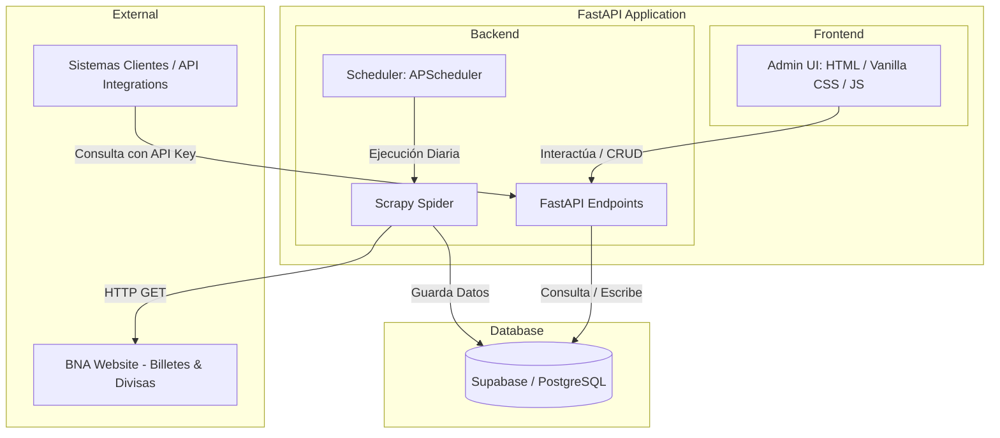

# Especificación Funcional y Técnica
## Sistema de Monitoreo de Cotizaciones BNA (Dólar y Euro)

Este documento detalla la especificación funcional y técnica para el desarrollo de la aplicación de extracción, almacenamiento y gestión de cotizaciones oficiales del Banco de la Nación Argentina (BNA).

---

## 1. Arquitectura General del Sistema

El sistema se diseñará bajo una arquitectura unificada en **Python**, utilizando un único servicio que contenga tanto la lógica del backend como la interfaz del usuario (frontend).



### Componentes Clave:
* **Extractor (Scraper):** Desarrollado con **Scrapy** para parsear de forma estructurada el sitio de personas del BNA.
* **Servidor Backend:** Desarrollado con **FastAPI** para servir las APIs públicas (con API Key), APIs administrativas (con sesión) y montar los archivos estáticos del frontend.
* **Base de Datos:** **Supabase (PostgreSQL)** para el almacenamiento de cotizaciones, API keys de clientes y logs de auditoría.
* **Planificador (Scheduler):** Integrado en el backend con **APScheduler** para ejecutar el scraper automáticamente cada día.

---

## 2. Especificación Técnica de Base de Datos (Supabase)

Se estructurarán tres tablas principales en la base de datos PostgreSQL de Supabase.

### 2.1. Tabla `cotizaciones`
Almacena el histórico de valores de compra y venta.

```sql
CREATE TABLE cotizaciones (
    id UUID PRIMARY KEY DEFAULT gen_random_uuid(),
    fecha_registro DATE NOT NULL DEFAULT CURRENT_DATE, -- Fecha calendario del registro (cubre feriados/fines de semana)
    fecha_oficial_bna DATE NOT NULL,                   -- Fecha real extraída de la tabla del BNA
    hora_actualizacion VARCHAR(10) NOT NULL,           -- Hora real de actualización de la cotización en el BNA (ej: "17:02")
    moneda VARCHAR(10) NOT NULL CHECK (moneda IN ('USD', 'EUR')),
    tipo VARCHAR(10) NOT NULL CHECK (tipo IN ('billete', 'divisa')),
    compra NUMERIC(12, 4) NOT NULL,
    venta NUMERIC(12, 4) NOT NULL,
    origen VARCHAR(10) NOT NULL DEFAULT 'scraped' CHECK (origen IN ('scraped', 'manual')),
    creado_por VARCHAR(100) DEFAULT 'sistema',         -- Nombre de usuario si fue manual, o 'sistema'
    created_at TIMESTAMPTZ DEFAULT NOW(),
    updated_at TIMESTAMPTZ DEFAULT NOW()
);

-- Restricción de unicidad para evitar duplicados en el mismo día calendario
CREATE UNIQUE INDEX idx_cotizaciones_registro_moneda_tipo 
ON cotizaciones (fecha_registro, moneda, tipo);
```

### 2.2. Tabla `api_keys`
Almacena las llaves de acceso dinámicas otorgadas a clientes externos.

```sql
CREATE TABLE api_keys (
    id UUID PRIMARY KEY DEFAULT gen_random_uuid(),
    cliente_nombre VARCHAR(150) NOT NULL,              -- Nombre del cliente o servicio
    cliente_email VARCHAR(150) NOT NULL,               -- Email de contacto
    api_key_hash VARCHAR(64) NOT NULL UNIQUE,          -- Hash SHA-256 de la API Key para validación segura
    api_key_prefix VARCHAR(15) NOT NULL,               -- Prefijo visible para el administrador (ej: "bna_live_a3b2")
    activo BOOLEAN NOT NULL DEFAULT TRUE,
    created_at TIMESTAMPTZ DEFAULT NOW(),
    updated_at TIMESTAMPTZ DEFAULT NOW()
);
```

### 2.3. Tabla `api_logs`
Almacena el registro de auditoría de consumo de las APIs por parte de los clientes externos.

```sql
CREATE TABLE api_logs (
    id UUID PRIMARY KEY DEFAULT gen_random_uuid(),
    api_key_id UUID REFERENCES api_keys(id) ON DELETE SET NULL,
    endpoint VARCHAR(255) NOT NULL,
    metodo VARCHAR(10) NOT NULL,
    ip_address VARCHAR(45) NOT NULL,
    status_code INTEGER NOT NULL,
    created_at TIMESTAMPTZ DEFAULT NOW()
);
```

---

## 3. Especificación Funcional

### 3.1. Proceso de Scrapeo Automático y Lógica de Fechas
1. El **Scheduler** integrado ejecuta el script de Scrapy diariamente a las **18:00 hs** (horario en el que el BNA ya ha consolidado sus cotizaciones del día).
2. El scraper realiza una petición HTTP al home del BNA (`https://www.bna.com.ar/Personas`).
3. **Fines de semana y Feriados:** El scraper se ejecutará igualmente. Dado que la web del BNA mantendrá congelada la cotización del último día hábil anterior (ej. viernes), el scraper guardará un registro para el sábado y otro para el domingo con `fecha_registro` correspondiente a esos días, pero apuntando a la misma `fecha_oficial_bna` (viernes). Esto garantiza la continuidad de la serie temporal para consultas automáticas sin interrupciones.

### 3.2. Funcionamiento Detallado del Extractor (Scrapy) e Inspección de Selectores
El scraper se conectará directamente a `https://www.bna.com.ar/Personas` con verificación SSL activa y un User-Agent realista. Basado en la inspección de la estructura HTML real del BNA, se utilizarán las siguientes especificaciones de extracción:

#### 3.2.1. Estructura HTML Identificada en BNA
Las tablas de cotizaciones están contenidas dentro de un contenedor principal `.tabSmall`:
* La pestaña de **Cotización Billetes** reside en `<div class="tab-pane fade in active" id="billetes">`.
* La pestaña de **Cotización Divisas** reside en `<div class="tab-pane fade" id="divisas">`.

#### 3.2.2. Selectores CSS y Lógica de Extracción

##### 1. Cotización Billetes:
* **Fecha Oficial:** Se extrae de la celda de cabecera:
  * Selector: `#billetes th.fechaCot::text` (Ej: `"22/5/2026"`).
* **Hora de Actualización:** Se extrae del pie de la tabla:
  * Selector: `#billetes div.legal::text` aplicando la expresión regular `Hora Actualización:\s*(\d{2}:\d{2})` (Ej: `"17:02"`).
* **Filas de Datos:** Se itera sobre `#billetes tbody tr`.
  * Filtro de moneda: Se inspecciona la celda `td.tit::text`. Si el texto limpio es `'Dolar U.S.A'` o `'Euro'`, se procesan sus columnas:
    * **Compra:** `td:nth-child(2)::text` (se limpia quitando espacios, se reemplaza la coma `,` por punto `.` y se convierte a decimal, ej: `"1375,00"` -> `1375.0`).
    * **Venta:** `td:nth-child(3)::text` (se limpia quitando espacios, se reemplaza la coma `,` por punto `.` y se convierte a decimal, ej: `"1425,00"` -> `1425.0`).

##### 2. Cotización Divisas:
* **Fecha Oficial:** Se extrae de la celda de cabecera:
  * Selector: `#divisas th.fechaCot::text` (Ej: `"22/5/2026"`).
* **Hora de Actualización:** Al no contar con hora explícita en este panel, se heredará la hora de actualización extraída de la pestaña de *Billetes* (o el tiempo de ejecución actual si no estuviera disponible).
* **Filas de Datos:** Se itera sobre `#divisas tbody tr`.
  * Filtro de moneda: Se inspecciona la celda `td.tit::text`. Si el texto limpio es `'Dolar U.S.A'` o `'Euro'`, se procesan sus columnas:
    * **Compra:** `td:nth-child(2)::text` (se convierte a decimal, ej: `"1394.0000"` -> `1394.0`).
    * **Venta:** `td:nth-child(3)::text` (se convierte a decimal, ej: `"1403.0000"` -> `1403.0`).

#### 3.2.3. Código de Referencia para el Parseo (Python/Scrapy)
A modo de guía técnica, el método `parse` de la Spider de Scrapy implementará la siguiente lógica:

```python
import scrapy
from datetime import datetime

class BnaSpider(scrapy.Spider):
    name = "bna_cotizaciones"
    start_urls = ["https://www.bna.com.ar/Personas"]

    def parse(self, response):
        # 1. Extraer metadatos comunes de Billetes
        fecha_billetes_raw = response.css('#billetes th.fechaCot::text').get()
        fecha_oficial_billetes = datetime.strptime(fecha_billetes_raw.strip(), "%d/%m/%Y").date() if fecha_billetes_raw else None
        
        hora_raw = response.css('#billetes div.legal::text').re_first(r'Hora Actualización:\s*(\d{2}:\d{2})')
        hora_actualizacion = hora_raw.strip() if hora_raw else "00:00"

        # 2. Extraer metadatos comunes de Divisas
        fecha_divisas_raw = response.css('#divisas th.fechaCot::text').get()
        fecha_oficial_divisas = datetime.strptime(fecha_divisas_raw.strip(), "%d/%m/%Y").date() if fecha_divisas_raw else None

        # 3. Procesar Billetes
        for row in response.css('#billetes tbody tr'):
            moneda_raw = row.css('td.tit::text').get()
            if not moneda_raw:
                continue
            
            moneda_clean = moneda_raw.strip()
            moneda = None
            if "Dolar" in moneda_clean:
                moneda = "USD"
            elif "Euro" in moneda_clean:
                moneda = "EUR"

            if moneda:
                compra = float(row.css('td:nth-child(2)::text').get().replace(',', '.'))
                venta = float(row.css('td:nth-child(3)::text').get().replace(',', '.'))
                yield {
                    "fecha_oficial_bna": fecha_oficial_billetes,
                    "hora_actualizacion": hora_actualizacion,
                    "moneda": moneda,
                    "tipo": "billete",
                    "compra": compra,
                    "venta": venta
                }

        # 4. Procesar Divisas
        for row in response.css('#divisas tbody tr'):
            moneda_raw = row.css('td.tit::text').get()
            if not moneda_raw:
                continue
            
            moneda_clean = moneda_raw.strip()
            moneda = None
            if "Dolar" in moneda_clean:
                moneda = "USD"
            elif "Euro" in moneda_clean:
                moneda = "EUR"

            if moneda:
                compra = float(row.css('td:nth-child(2)::text').get().replace(',', '.'))
                venta = float(row.css('td:nth-child(3)::text').get().replace(',', '.'))
                yield {
                    "fecha_oficial_bna": fecha_oficial_divisas or fecha_oficial_billetes,
                    "hora_actualizacion": hora_actualizacion, # Se hereda hora de billetes
                    "moneda": moneda,
                    "tipo": "divisa",
                    "compra": compra,
                    "venta": venta
                }
```


### 3.3. Panel de Administración (Frontend Embebido)
Para facilitar el despliegue, el frontend se desarrollará con tecnologías limpias (HTML5, Vanilla CSS moderno y Vanilla Javascript) servido directamente por FastAPI.

#### Diseño Visual Premium:
* **Estética:** Modo Oscuro refinado, combinando colores oscuros profundos (`#0d0e12`), tonos violeta/azul vibrantes para acentos, efectos de Glassmorphism (paneles translúcidos con desenfoque de fondo) y tipografía moderna (Google Fonts: *Inter* u *Outfit*).
* **Interacciones:** Transiciones fluidas al pasar el cursor sobre botones y filas de tablas, notificaciones en pantalla (`toast`) tras cada acción exitosa.

#### Vistas y Secciones:
1. **Login Básico:**
   * Pantalla de acceso que solicita usuario y contraseña.
   * Valida contra las variables de entorno `ADMIN_USERNAME` y `ADMIN_PASSWORD`.
   * Maneja sesión mediante una cookie segura (HTTP-only) o JWT de corta duración.
2. **Dashboard de Cotizaciones:**
   * Tabla histórica con todas las cotizaciones ordenadas de forma cronológica.
   * Filtros dinámicos por moneda (Dólar/Euro), tipo (Billete/Divisa) y rango de fechas.
   * Botón para **"Cargar Cotización a Mano"** que abre un modal con validaciones de campos.
   * Botón para **Editar** y **Eliminar** en cada fila de cotización.
   * Botón para **"Forzar Scrapeo Ahora"** que ejecuta el scraper manualmente en segundo plano y refresca la tabla al finalizar.
3. **Gestión de Clientes y API Keys:**
   * Formulario para registrar un nuevo cliente (`Nombre` e `Email`).
   * Al hacer clic en "Generar API Key", el sistema generará una clave aleatoria segura de formato `bna_live_xxxxxxxxxxxxx`, mostrará la clave completa **una sola vez** al administrador para que la copie, guardará el hash SHA-256 en la base de datos y mostrará el prefijo de seguridad en el listado.
   * Tabla con el listado de API Keys activas y la opción de **Revocar** (desactivar/eliminar) el acceso del cliente de forma inmediata.
4. **Logs de Auditoría:**
   * Vista de auditoría que lista en tiempo real quién está llamando a la API.
   * Muestra: Fecha/Hora, Nombre del Cliente, Email, Endpoint consultado, Estado HTTP (ej. 200 OK, 401 Unauthorized) e IP de origen.

---

## 4. Endpoints de la API

### 4.1. APIs para Clientes Externos (Protegidas por API Key)
*Cualquier llamada a estos endpoints requiere la cabecera `X-API-Key: bna_live_...`.*

* **`GET /api/v1/cotizaciones`**
  * Obtiene el listado de cotizaciones.
  * **Parámetros opcionales:**
    * `fecha` (YYYY-MM-DD): Filtra por la fecha de registro. Si es fin de semana/feriado, devolverá la cotización registrada en esa fecha calendario.
    * `moneda` ('USD' o 'EUR')
    * `tipo` ('billete' o 'divisa')
  * **Respuesta de ejemplo (200 OK):**
    ```json
    [
      {
        "id": "8f2a1b3c-4d5e-6f7a-8b9c-0d1e2f3a4b5c",
        "fecha_registro": "2026-05-23",
        "fecha_oficial_bna": "2026-05-22",
        "hora_actualizacion": "17:02",
        "moneda": "USD",
        "tipo": "billete",
        "compra": 1375.0000,
        "venta": 1425.0000,
        "origen": "scraped"
      }
    ]
    ```

### 4.2. APIs Administrativas (Protegidas por Sesión / JWT)
*Solo accesibles para el Frontend del Administrador autenticado.*

* **`POST /api/admin/login`**
  * Procesa las credenciales de administración e inicia la sesión.
* **`GET /api/admin/cotizaciones`**
  * Obtiene todas las cotizaciones con metadatos de auditoría (`creado_por`, `origen`, etc.).
* **`POST /api/admin/cotizaciones`**
  * Crea una cotización de forma manual.
* **`PUT /api/admin/cotizaciones/{id}`**
  * Actualiza los datos de una cotización existente.
* **`DELETE /api/admin/cotizaciones/{id}`**
  * Elimina físicamente una cotización.
* **`POST /api/admin/api-keys`**
  * Genera una nueva API Key para un cliente.
* **`DELETE /api/admin/api-keys/{id}`**
  * Revoca y deshabilita una API Key.
* **`GET /api/admin/api-keys`**
  * Lista las llaves generadas (prefijo, cliente, fecha de creación).
* **`GET /api/admin/logs`**
  * Devuelve los registros de auditoría de la tabla `api_logs`.
* **`POST /api/admin/scrape/trigger`**
  * Desencadena la ejecución asíncrona del Scrapy Spider inmediatamente.

---

## 5. Middleware de Auditoría y Autenticación

1. **Autenticación por API Key:**
   * Se creará una dependencia en FastAPI (`get_api_key`) que extrae el token del header `X-API-Key`.
   * Hashea la clave recibida en SHA-256.
   * Busca el hash en la tabla `api_keys`. Si la clave existe y está activa, permite la consulta; de lo contrario, retorna un error `401 Unauthorized`.
2. **Middleware de Logging:**
   * Se implementará un middleware de FastAPI que interceptará todas las peticiones con prefijo `/api/v1/`.
   * Si la petición es válida (o incluso si es fallida pero incluye una API Key reconocible), insertará de forma asíncrona un registro en `api_logs` guardando la relación del cliente, el método, el endpoint y el código de estado devuelto.

---

## 6. Plan de Verificación y Testing

### 6.1. Pruebas del Scraper:
* Simular la respuesta HTML del BNA usando archivos locales (Mocks) para asegurar que los selectores CSS sigan extrayendo correctamente "compra", "venta", "fecha" y "hora".
* Probar la integración de persistencia insertando cotizaciones de prueba en la base de datos de Supabase local o de desarrollo.

### 6.2. Pruebas de APIs:
* Verificar que el endpoint `/api/v1/cotizaciones` devuelva error `401` cuando no se provee la cabecera `X-API-Key` o cuando esta es inválida.
* Validar que las peticiones correctas registren correctamente su traza en la tabla `api_logs`.

### 6.3. Pruebas de Frontend:
* Verificar el flujo de login administrativo (credenciales correctas e incorrectas).
* Ejecutar pruebas manuales de creación, edición y eliminación de cotizaciones comprobando que los cambios se reflejen inmediatamente en la pantalla y base de datos.
